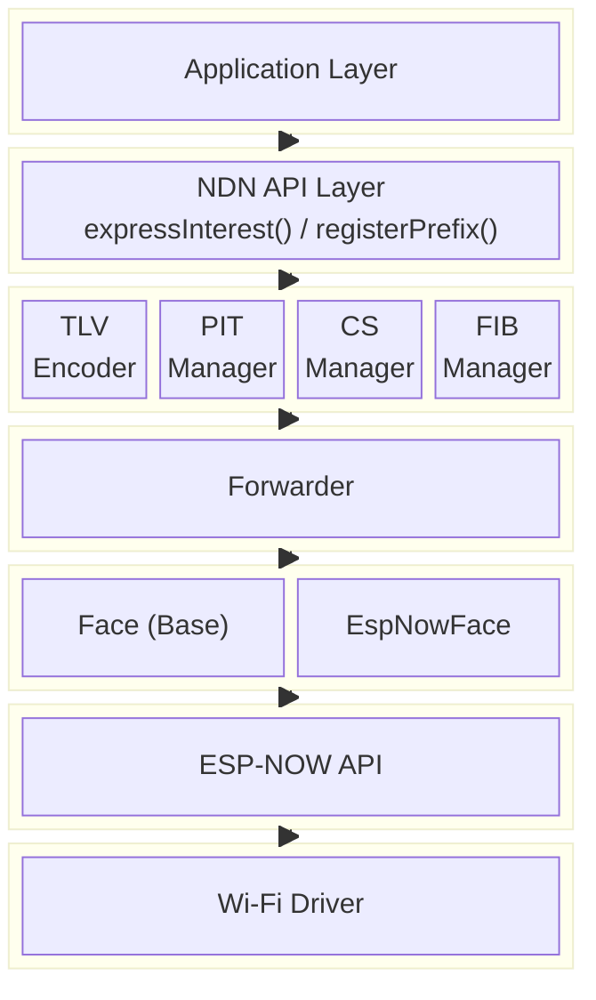

# ndn-embeds

Lightweight [Named Data Networking (NDN)](https://named-data.net/) protocol stack for embedded systems, designed as an [ESP-IDF](https://github.com/espressif/esp-idf) component.

<div align="center">
  
  <p><em>Real-time camera streaming over NDN with ESP-NOW</em></p>
</div>

## Features

- **Full NDN packet encoding/decoding** — Interest, Data, Name with TLV wire format (NDN Packet Format Specification v0.3)
- **Forwarding engine** — Forwarder with PIT, CS (Content Store with LRU eviction), and FIB (longest-prefix match)
- **ESP-NOW Face** — Zero-configuration peer-to-peer communication over ESP-NOW
- **ECDSA P-256 signatures** — Data signing and verification using mbedTLS
- **X.509 certificate support** — NDN Certificate v2 format encoding/decoding
- **Link object support** — Forwarding hints for multi-hop routing
- **No dynamic allocation** — All data structures use fixed-size arrays; no `new`/`delete`
- **No exceptions** — Error handling via `Result<T>` return types
- **C++23** — Modern C++ with `std::optional`, `std::array`, `std::string_view`
- **214 unit tests** — Comprehensive test coverage with ESP-IDF Unity framework

## Requirements

- ESP-IDF v5.0 or later
- Target: ESP32, ESP32-S3, ESP32-C3, or ESP32-C6

## Installation

### As an ESP-IDF component (recommended)

```bash
cd your_project
mkdir -p components
cd components
git clone https://github.com/sou1118/ndn-embeds.git ndn
```

### Via ESP Component Registry

```bash
idf.py add-dependency "sou1118/ndn-embeds"
```

## Quick Start

### Consumer

```cpp
#include <ndn/ndn.hpp>

extern "C" void app_main() {
    ndn::initialize();

    auto& fwd = ndn::getForwarder();
    ndn::EspNowFace face;
    face.start();
    fwd.addFace(&face);

    ndn::Interest interest;
    interest.setName("/sensor/temperature")
            .setLifetime(4000)
            .generateNonce();

    fwd.expressInterest(interest,
        [](const ndn::Data& data) {
            printf("Received: %.*s\n",
                   (int)data.contentSize(),
                   (const char*)data.content());
        },
        [](const ndn::Interest&) {
            printf("Timeout\n");
        }
    );

    while (true) {
        face.processReceiveQueue();
        fwd.processEvents();
        vTaskDelay(pdMS_TO_TICKS(10));
    }
}
```

### Producer

```cpp
#include <ndn/ndn.hpp>

extern "C" void app_main() {
    ndn::initialize();

    auto& fwd = ndn::getForwarder();
    ndn::EspNowFace face;
    face.start();
    fwd.addFace(&face);

    fwd.registerPrefix("/sensor/temperature",
        [](const ndn::Interest& interest, ndn::FaceId) {
            ndn::Data data;
            data.setName(interest.name());
            data.setContent("25.5");
            data.setFreshnessPeriod(5000);
            ndn::putData(data);
        }
    );

    while (true) {
        face.processReceiveQueue();
        fwd.processEvents();
        vTaskDelay(pdMS_TO_TICKS(10));
    }
}
```

## Architecture



## API Overview

| Module | Header | Description |
|--------|--------|-------------|
| Common | `ndn/common.hpp` | Error codes, `Result<T>`, constants |
| TLV | `ndn/tlv.hpp` | TLV encoder/decoder |
| Name | `ndn/name.hpp` | NDN Name with component operations |
| Interest | `ndn/interest.hpp` | Interest packet (Nonce, Lifetime, HopLimit) |
| Data | `ndn/data.hpp` | Data packet (Content, FreshnessPeriod) |
| Signature | `ndn/signature.hpp` | SignatureInfo/SignatureValue |
| Crypto | `ndn/crypto.hpp` | ECDSA P-256 signing/verification |
| Certificate | `ndn/certificate.hpp` | NDN Certificate v2 |
| Link | `ndn/link.hpp` | Link object with delegation list |
| PIT | `ndn/pit.hpp` | Pending Interest Table |
| CS | `ndn/cs.hpp` | Content Store (LRU) |
| FIB | `ndn/fib.hpp` | Forwarding Information Base |
| Face | `ndn/face.hpp` | Abstract face interface |
| Forwarder | `ndn/forwarder.hpp` | NDN forwarder |
| EspNowFace | `adapters/espnow_face.hpp` | ESP-NOW transport |

## Constraints

| Resource | Limit |
|----------|-------|
| ESP-NOW max payload | 250 bytes |
| Name max length | 128 bytes |
| Name max components | 10 |
| Data max content size | 200 bytes |
| PIT entries | 50 |
| CS entries | 20 |
| FIB entries | 30 |
| Interest default lifetime | 4000 ms |

## Documentation

API documentation is available at **<https://sou1118.github.io/ndn-embeds/>**

Generated automatically from source comments using Doxygen on each push to `main`.

## Running Tests

```bash
cd test_app
idf.py set-target esp32s3
idf.py build
idf.py -p /dev/ttyUSB0 flash monitor
```

## License

Apache License 2.0. See [LICENSE](LICENSE) for details.
