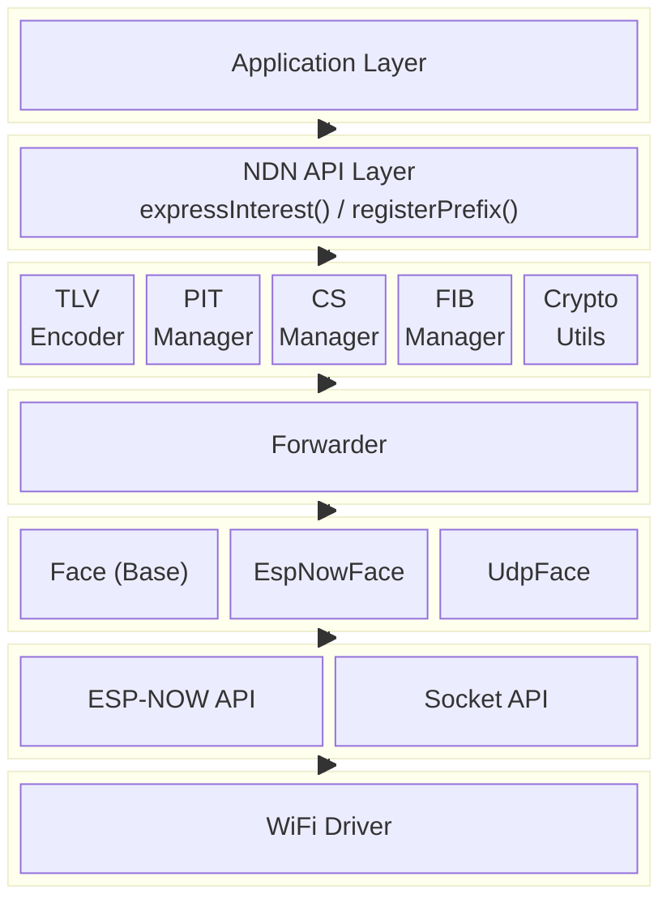
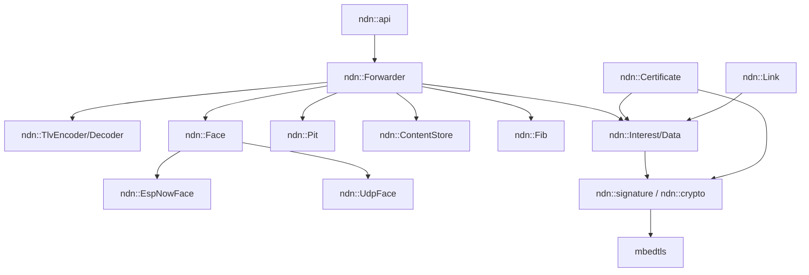
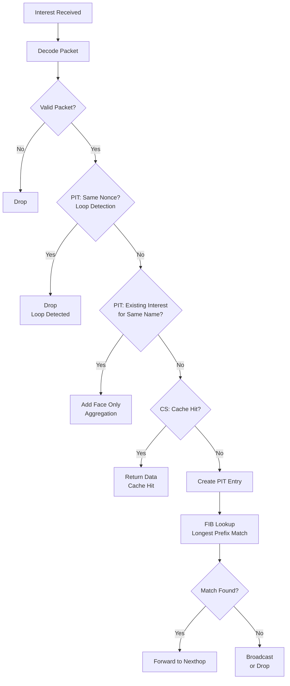
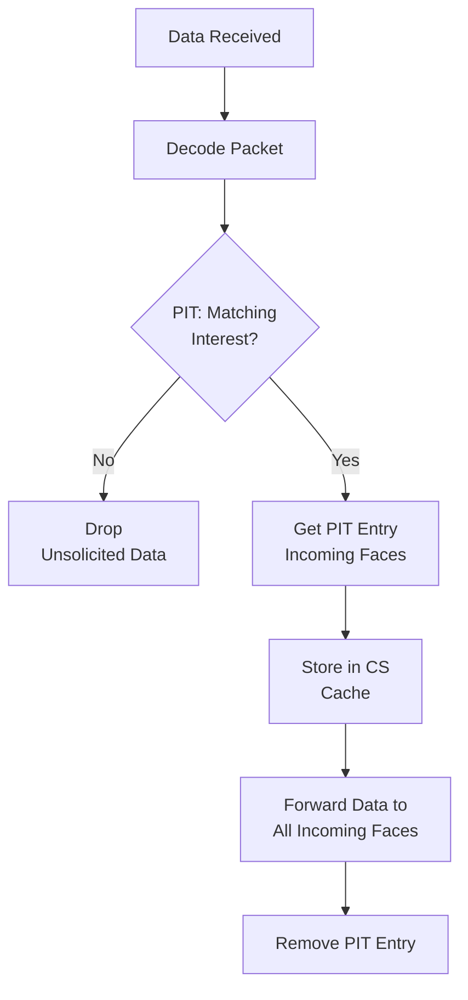
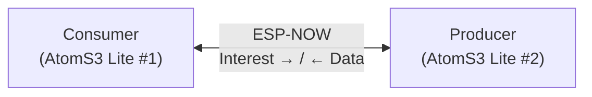
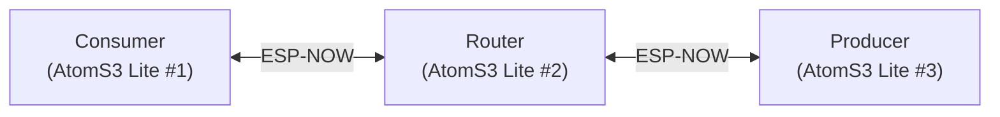
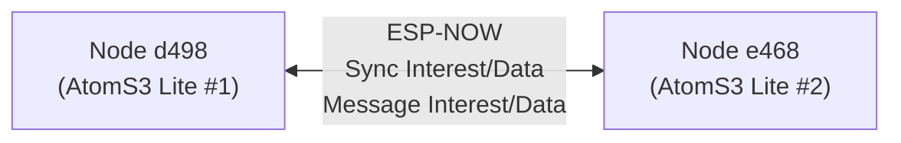
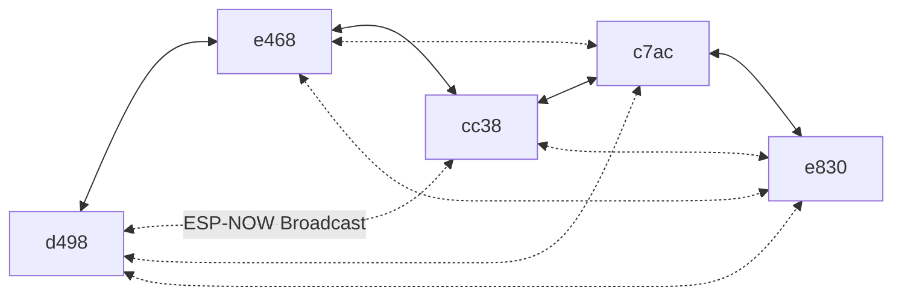
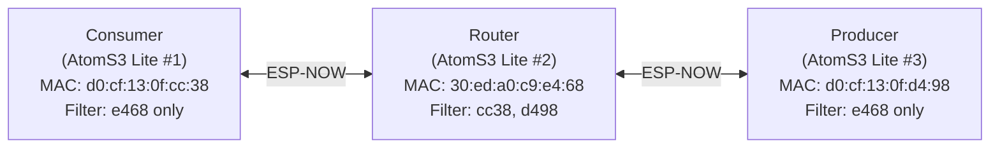

# System Architecture

## 1. Layer Structure



## 2. Module Structure

- **`include/ndn/`** — Public headers
  - `common.hpp` — Core types, error codes, constants
  - `tlv.hpp` — TLV encoder/decoder
  - `name.hpp` — Name class
  - `interest.hpp` — Interest packet class
  - `data.hpp` — Data packet class
  - `signature.hpp` — Signature types and constants
  - `crypto.hpp` — Cryptographic utilities (SHA-256, HMAC, ECDSA)
  - `certificate.hpp` — NDN Certificate and ValidityPeriod
  - `link.hpp` — Link Object (ForwardingHint delegations)
  - `pit.hpp` — PendingInterestTable
  - `cs.hpp` — ContentStore
  - `fib.hpp` — ForwardingInfoBase
  - `face.hpp` — Face base class
  - `forwarder.hpp` — Forwarder
  - `ndn.hpp` — Convenience header (includes all public headers)
- **`src/`** — Implementation
  - `tlv.cpp`, `name.cpp`, `interest.cpp`, `data.cpp`, `crypto.cpp`, `certificate.cpp`, `link.cpp`, `pit.cpp`, `cs.cpp`, `fib.cpp`, `face.cpp`, `forwarder.cpp`, `api.cpp`, `common.cpp`
- **`adapters/`** — Transport-specific Face implementations
  - `espnow_face.hpp` / `espnow_face.cpp` — ESP-NOW Face
- **`test/`** — Unit tests
  - `test_tlv.cpp`, `test_name.cpp`, `test_interest.cpp`, `test_data.cpp`, `test_signature.cpp`, `test_certificate.cpp`, `test_link.cpp`, `test_pit.cpp`, `test_cs.cpp`, `test_fib.cpp`, `test_forwarder.cpp`, `test_espnow_face.cpp`
- `Kconfig`, `CMakeLists.txt`

## 3. Dependency Graph



## 4. Component Details

### 4.1 TLV Encoder/Decoder

**Responsibilities:**

- Encode and decode VAR-NUMBER values
- Read and write TLV headers (Type + Length)
- Handle NonNegativeInteger encoding

```cpp
namespace ndn {

class TlvEncoder {
public:
    TlvEncoder(uint8_t* buf, size_t capacity);

    Error writeVarNumber(uint64_t value);
    Error writeNonNegativeInteger(uint64_t value);
    Error writeType(uint32_t type);
    Error writeLength(size_t length);
    Error writeBytes(const uint8_t* data, size_t len);
    Error writeTlv(uint32_t type, const uint8_t* value, size_t valueLen);
    Error writeTlvNonNegativeInteger(uint32_t type, uint64_t value);

    size_t size() const;
    size_t remaining() const;
    uint8_t* current();
    size_t position() const;
    void setPosition(size_t pos);
};

class TlvDecoder {
public:
    TlvDecoder(const uint8_t* buf, size_t len);

    struct TlvHeader {
        uint32_t type;
        size_t length;
    };

    Result<uint64_t> readVarNumber();
    Result<uint64_t> readNonNegativeInteger(size_t numBytes);
    Result<uint32_t> readType();
    Result<size_t> readLength();
    Result<TlvHeader> readTlvHeader();
    Error readBytes(uint8_t* out, size_t len);
    Error skip(size_t len);

    size_t remaining() const;
    const uint8_t* current() const;
    bool hasMore() const;
    size_t position() const;
    void setPosition(size_t pos);
};

// Utility functions
constexpr size_t varNumberSize(uint64_t value);
constexpr size_t nonNegativeIntegerSize(uint64_t value);

}  // namespace ndn
```

### 4.2 Face Base Class

**Responsibilities:**

- Abstract the communication interface for different transports
- Provide a unified API for send/receive operations

```cpp
namespace ndn {

using PacketCallback = std::function<void(FaceId, const uint8_t*, size_t)>;

class Face {
public:
    virtual ~Face() = default;

    virtual FaceId id() const = 0;
    virtual Error start() = 0;
    virtual void stop() = 0;

    virtual Error send(const uint8_t* data, size_t len) = 0;
    virtual Error sendTo(FaceId dest, const uint8_t* data, size_t len) = 0;
    virtual Error broadcast(const uint8_t* data, size_t len) = 0;

    virtual size_t maxPayloadSize() const = 0;

    void setPacketCallback(PacketCallback cb);

protected:
    void onPacketReceived(FaceId faceId, const uint8_t* data, size_t len);
    PacketCallback packetCallback_;
};

}  // namespace ndn
```

### 4.3 Forwarder

**Responsibilities:**

- Core Interest/Data processing logic
- Coordination of PIT, CS, and FIB
- Execution of the forwarding strategy
- Application-facing API (consumer and producer)

```cpp
namespace ndn {

class Forwarder {
public:
    Forwarder();
    Error init(size_t csMaxEntries = CS_DEFAULT_ENTRIES);

    // Face management
    Error addFace(Face* face);
    void removeFace(FaceId faceId);

    // Consumer API
    Error expressInterest(const Interest& interest,
                          DataCallback onData,
                          TimeoutCallback onTimeout = nullptr);
    Error sendInterest(const Interest& interest);

    // Producer API
    Error registerPrefix(const Name& prefix, InterestCallback callback);
    Error registerPrefix(std::string_view prefixUri, InterestCallback callback);
    void unregisterPrefix(const Name& prefix);
    Error putData(const Data& data);

    // FIB route management
    Error addRoute(const Name& prefix, FaceId faceId, uint8_t cost = 0);
    Error addRoute(std::string_view prefixUri, FaceId faceId, uint8_t cost = 0);

    // Event processing
    void processEvents();

    // Statistics
    struct Stats {
        uint32_t interestsReceived = 0;
        uint32_t interestsSent = 0;
        uint32_t dataReceived = 0;
        uint32_t dataSent = 0;
        uint32_t cacheHits = 0;
        uint32_t cacheMisses = 0;
    };
    const Stats& stats() const;

    // Internal component access (for testing)
    Pit& pit();
    ContentStore& cs();
    Fib& fib();

private:
    void onPacketReceived(FaceId faceId, const uint8_t* data, size_t len);
    void onInterestReceived(FaceId faceId, const Interest& interest);
    void onDataReceived(FaceId faceId, const Data& data);
    void forwardInterest(const Interest& interest, FaceId incomingFace);
    void forwardData(const Data& data, PitEntry* pitEntry);
};

}  // namespace ndn
```

### 4.4 ESP-NOW Face

```cpp
// adapters/espnow_face.hpp

namespace ndn {

constexpr size_t ESPNOW_MAX_PAYLOAD = 1470;  // ESP-NOW v2.0
constexpr size_t ESPNOW_MAX_PEERS = 20;

// Generate a FaceId from the lower 2 bytes of a MAC address (+2 offset)
inline FaceId macToFaceId(const uint8_t* mac);

struct PeerInfo {
    uint8_t mac[6];
    FaceId faceId;
    bool inUse;
    uint32_t lastSeen;
};

class EspNowFace : public Face {
public:
    explicit EspNowFace(FaceId faceId = 2);
    ~EspNowFace() override;

    FaceId id() const override;
    Error start() override;
    void stop() override;

    Error send(const uint8_t* data, size_t len) override;
    Error sendTo(FaceId dest, const uint8_t* data, size_t len) override;
    Error broadcast(const uint8_t* data, size_t len) override;

    size_t maxPayloadSize() const override { return ESPNOW_MAX_PAYLOAD; }

    // Peer management
    FaceId addPeer(const uint8_t* mac);
    void removePeer(FaceId faceId);
    bool getMacAddress(FaceId faceId, uint8_t* mac) const;
    size_t peerCount() const;

    // Receive queue processing (called from main loop)
    void processReceiveQueue();

    // MAC address filtering (for topology control)
    void setMacFilter(const uint8_t* mac);
    void setMacFilters(const uint8_t macs[][6], size_t count);
    void clearMacFilters();
    bool hasMacFilter() const;

    static constexpr size_t MAX_MAC_FILTERS = 4;

private:
    static void onReceive(const esp_now_recv_info_t* info,
                          const uint8_t* data, int len);
    static void onSend(const esp_now_send_info_t* info,
                       esp_now_send_status_t status);

    std::array<PeerInfo, ESPNOW_MAX_PEERS> peers_;

    // ISR-safe receive queue
    static constexpr size_t RX_QUEUE_SIZE = 8;
    std::array<RxPacket, RX_QUEUE_SIZE> rxQueue_;
};

}  // namespace ndn
```

**Key features:**

- Automatic peer discovery: sender MAC is auto-registered on receive
- ISR-safe: the receive callback only enqueues packets
- Broadcast support: well-suited for NDN flooding
- MAC address filtering: enables virtual topology control for multi-hop experiments
- ESP-NOW v2.0: supports payloads up to 1470 bytes

### 4.5 Signature and Cryptography

**Responsibilities:**

- Define signature algorithm types and size constants
- Provide SHA-256, HMAC-SHA256, and ECDSA P-256 operations via mbedtls

```cpp
namespace ndn {

enum class SignatureType : uint8_t {
    DigestSha256 = 0,              // SHA-256 digest (integrity only)
    SignatureSha256WithRsa = 1,    // RSA signature (PKCS#1 v1.5)
    SignatureSha256WithEcdsa = 3,  // ECDSA signature
    SignatureHmacWithSha256 = 4,   // HMAC-SHA256 (shared key)
    SignatureEd25519 = 5,          // Ed25519 signature
};

}  // namespace ndn

namespace ndn::crypto {

Error sha256(const uint8_t* data, size_t len, uint8_t* out);
Error hmacSha256(const uint8_t* key, size_t keyLen,
                 const uint8_t* data, size_t dataLen, uint8_t* out);
bool constantTimeCompare(const uint8_t* lhs, const uint8_t* rhs, size_t len);
Error ecdsaP256GenerateKeyPair(uint8_t* privKey, uint8_t* pubKey);
Error ecdsaP256Sign(const uint8_t* privKey, const uint8_t* data,
                    size_t dataLen, uint8_t* sig, size_t* sigLen);
bool ecdsaP256Verify(const uint8_t* pubKey, const uint8_t* data,
                     size_t dataLen, const uint8_t* sig, size_t sigLen);

}  // namespace ndn::crypto
```

Both Interest and Data packets support signing and verification with all implemented algorithms:

| Algorithm | Data Sign/Verify | Interest Sign/Verify |
|-----------|:---:|:---:|
| DigestSha256 | Yes | Yes |
| HMAC-SHA256 | Yes | Yes |
| ECDSA P-256 | Yes | Yes |

### 4.6 Certificate

**Responsibilities:**

- Represent NDN certificates (special Data packets with `ContentType=KEY`)
- Manage validity periods in ISO 8601 format
- Encode/decode the certificate name format: `/<IdentityName>/KEY/<KeyId>/<IssuerId>/<Version>`

```cpp
namespace ndn {

class ValidityPeriod {
public:
    static Result<ValidityPeriod> fromStrings(std::string_view notBefore,
                                              std::string_view notAfter);
    static Result<ValidityPeriod> fromWire(const uint8_t* buf, size_t len,
                                           size_t* bytesRead = nullptr);
    Error encode(uint8_t* buf, size_t bufSize, size_t& encodedLen) const;

    Error setNotBefore(uint16_t year, uint8_t month, uint8_t day,
                       uint8_t hour, uint8_t minute, uint8_t second);
    Error setNotAfter(uint16_t year, uint8_t month, uint8_t day,
                      uint8_t hour, uint8_t minute, uint8_t second);
    bool isValidAt(std::string_view currentTimestamp) const;
};

class Certificate {
public:
    static Result<Certificate> fromData(const Data& data);
    static Result<Certificate> fromWire(const uint8_t* buf, size_t len);
    Error toData(Data& data) const;
    Error encode(uint8_t* buf, size_t bufSize, size_t& encodedLen) const;
    Error buildName(Name& name) const;

    // Identity, key, issuer, version, public key, validity, signature...
    Error signWithDigestSha256();
    Error signWithHmac(const uint8_t* key, size_t keyLen);
    bool verifyDigestSha256() const;
    bool verifyHmac(const uint8_t* key, size_t keyLen) const;
};

}  // namespace ndn
```

### 4.7 Link Object

**Responsibilities:**

- Represent Link Objects (special Data packets with `ContentType=LINK`)
- Manage a prioritized list of delegation Names for ForwardingHint

```cpp
namespace ndn {

class Link {
public:
    explicit Link(const Name& name);

    Error addDelegation(const Name& delegation);
    Error addDelegation(std::string_view uri);
    size_t delegationCount() const;
    const Name* delegation(size_t index) const;
    void clearDelegations();
    bool hasDelegation(const Name& name) const;

    Error toData(Data& data) const;
    static Result<Link> fromData(const Data& data);
};

}  // namespace ndn
```

## 5. Processing Flows

### 5.1 Interest Receive Processing



### 5.2 Data Receive Processing



### 5.3 Timeout Processing

```cpp
// Executed periodically inside Forwarder::processEvents()
void Forwarder::processEvents() {
    TimeMs now = currentTimeMs();

    // PIT timeout processing
    pit_.processTimeouts(now, [this](const PitEntry& entry) {
        // Invoke application timeout callbacks
        for (auto& pending : pendingInterests_) {
            if (pending.inUse && entry.name() == pending.interest.name()) {
                if (pending.timeoutCallback) {
                    pending.timeoutCallback(pending.interest);
                }
                pending.inUse = false;
            }
        }
    });

    // Evict stale CS entries
    cs_.evictStale(now);
}
```

## 6. Hardware Test Results

### 6.1 ESP-NOW Ping Test (2-Node Setup)

End-to-end NDN Interest/Data communication tested between two M5Stack AtomS3 Lite devices.

**Test Setup:**



**Results:**

| Metric | Value |
|--------|-------|
| Packet Loss Rate | 2.9% |
| Average RTT | 10-11 ms |
| Maximum RTT | 30 ms |

**Verified Component Behavior:**

| Component | Status |
|-----------|--------|
| TLV Encode/Decode | Passed |
| Name Creation/Parsing | Passed |
| Interest Creation/Send | Passed |
| Data Creation/Reply | Passed |
| PIT (Pending Interest Table) | Passed |
| FIB (Forwarding Information Base) | Passed |
| ESP-NOW Face | Passed |
| Forwarder | Passed |

### 6.2 Content Store Cache Hit Test (3-Node Setup)

Content Store caching behavior verified using three M5Stack AtomS3 Lite devices.

**Test Setup:**



**MAC Filtering:** Consumer and Producer only receive packets from the Router.

**Results:**

| Metric (Router) | Value |
|-----------------|-------|
| Cache Hits | 20 |
| Cache Misses | 71 |
| CS Insertions | 11 |
| CS Evictions | 9 |

**Verified Content Store Behavior:**

| Feature | Status |
|---------|--------|
| Data Insertion (insert) | Passed |
| Lookup (find) | Passed |
| Cache Hit Response | Passed |
| LRU Eviction | Passed |
| FreshnessPeriod | Passed |

### 6.3 Sync Chat Test (2-Node Setup)

Distributed chat functionality verified using an NDN Sync protocol between two M5Stack AtomS3 Lite devices.

**Test Setup:**



**Protocol Operation:**

1. Each node computes a CRC32 digest of its state
2. Periodically sends a Sync Interest (`/chat/room1/sync/<digest>`)
3. If digests differ, exchanges diff information via Sync Data
4. Retrieves missing messages via Message Interest (`/chat/room1/msg/<nodeId>/<seq>`)

**Results:**

| Feature | Status |
|---------|--------|
| Sync Interest Send/Receive | Passed |
| Digest Comparison | Passed |
| Diff Detection | Passed |
| Message Synchronization | Passed |
| Final State Consistency | Passed |

### 6.4 5-Node Sync Test (Sync Chat Scalability)

Sync Chat protocol scalability verified using five M5Stack AtomS3 Lite devices.

**Test Setup:**



**Results:**

| Metric | Value |
|--------|-------|
| Node Count | 5 |
| Message Delivery Rate | 100% (all nodes received all messages) |
| Final Digest | `7309b38a` |
| Convergence Time | ~40 seconds |

**Verified Sync Behavior:**

| Feature | Status |
|---------|--------|
| 5-Node Mutual Sync | Passed |
| Digest Convergence | Passed |
| Complete Message Delivery | Passed |
| Recovery from Temporary Loss | Passed |

### 6.5 Multi-Hop Forwarding Test (3-Node Virtual Topology)

NDN multi-hop forwarding verified using MAC filtering to create a virtual topology.

**Test Setup:**



**Virtual Topology via MAC Filtering:**

- Consumer/Producer only accept packets from the Router's MAC
- Router accepts packets from both Consumer and Producer MACs
- Result: a linear topology Consumer <-> Router <-> Producer

**Results:**

| Metric | Value |
|--------|-------|
| RTT (via Router) | 50-60 ms |
| Interest Forwarding | Passed |
| Data Forwarding | Passed |

**Verified NDN Multi-Hop Behavior:**

| Feature | Status |
|---------|--------|
| Interest Forwarding (FIB-based) | Passed |
| Data Forwarding (PIT-based) | Passed |
| Router Relay (Intermediate Node) | Passed |
| MAC Filter Topology Control | Passed |
| Multiple MAC Filters | Passed |

### 6.6 Quantitative Cache Effect Measurement (3-Node Setup)

Quantitative measurement of RTT reduction achieved by the Router's Content Store cache.

**Test Setup:**


**Cache Test Mode:** The same Interest is sent 3 times in succession. The 1st request (cache miss) and 2nd-3rd requests (cache hits) are compared for RTT.

**Results:**

| Metric | Value |
|--------|-------|
| Cache Miss Average RTT | ~52 ms |
| Cache Hit Average RTT | ~27 ms |
| **RTT Reduction** | **~48%** |

**Router Statistics (Final):**

| Metric | Value |
|--------|-------|
| Cache Hits | 24 |
| Cache Misses | 21 |
| CS Insertions | 21 |
| CS Evictions | 19 |

**Bug Fix Applied:**

- When returning Data on a cache hit, `send()` (broadcast) was being used instead of `sendTo(faceId, ...)` (unicast), causing the Data to not reach the specific requesting peer. Fixed to use unicast.

---

## 7. Future Extensions

### 7.1 Security Features

- [x] Data signing (DigestSha256)
- [x] Data signing (HMAC-SHA256)
- [x] Data signing (ECDSA P-256)
- [x] Interest signing (DigestSha256, HMAC-SHA256, ECDSA P-256)
- [x] KeyLocator support
- [x] NDN Certificate (ValidityPeriod, public key management)
- [ ] Encryption (AES-128)
- [ ] Access Control

### 7.2 Advanced Forwarding Strategies

- [ ] Multicast Strategy
- [ ] Best-Route Strategy
- [ ] Load Balancing
- [ ] Adaptive Forwarding

### 7.3 Additional Face Adapters

- [ ] BLE Face
- [ ] LoRa Face
- [ ] Serial Face (for debugging)

### 7.4 Sync Protocol

- [x] ChronoSync-style basic implementation
- [ ] PSync
- [ ] SVS (State Vector Sync)
