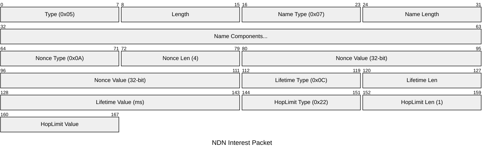
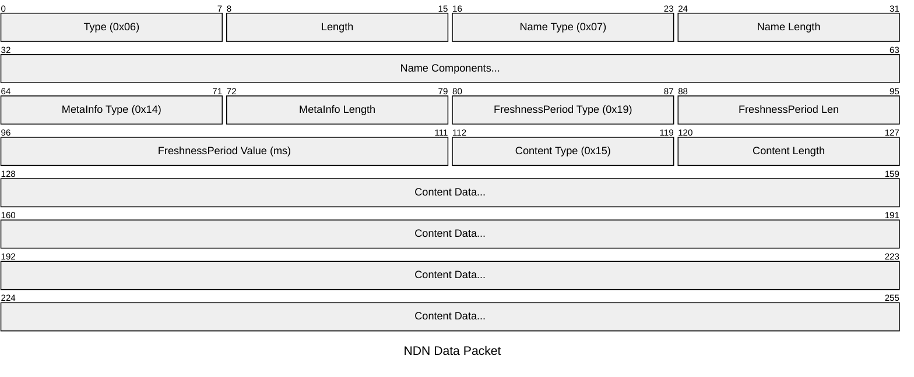
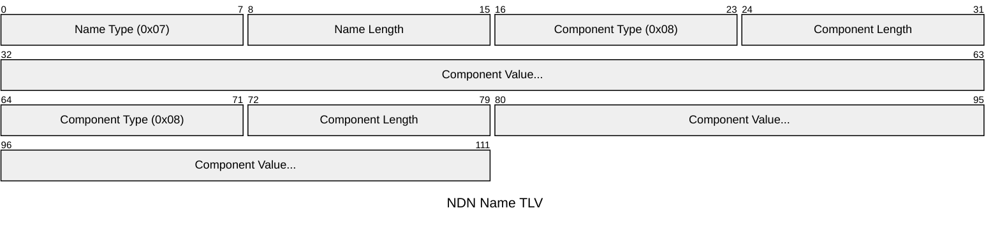
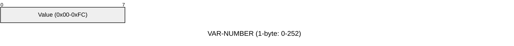
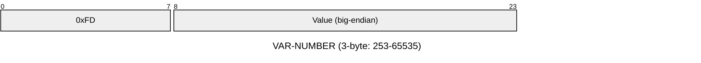
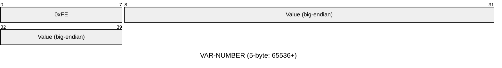
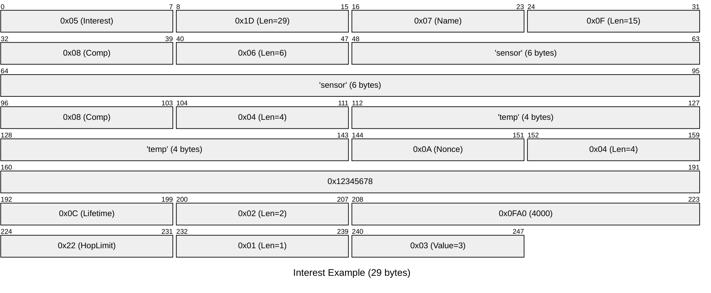
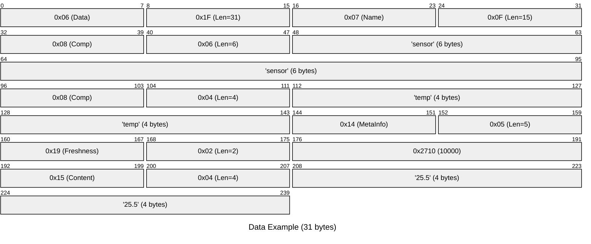

# NDN Packet Format

Compliant with NDN Packet Format Specification v0.3

## Overview Diagrams

### Interest Packet Structure



### Data Packet Structure



### Name Component Structure



### VAR-NUMBER Encoding







## 1. TLV Encoding

### 1.1 Basic Structure

```
NDN-TLV = TLV-TYPE TLV-LENGTH TLV-VALUE
TLV-TYPE = VAR-NUMBER
TLV-LENGTH = VAR-NUMBER
TLV-VALUE = *OCTET
```

### 1.2 VAR-NUMBER Encoding

| Value Range | Encoding |
|-------------|----------|
| 0 - 252 (0xFC) | 1 byte: value as-is |
| 253 - 65535 | 3 bytes: 0xFD + 2 bytes (big-endian) |
| 65536 - 4294967295 | 5 bytes: 0xFE + 4 bytes (big-endian) |
| > 4294967295 | 9 bytes: 0xFF + 8 bytes (big-endian) |

**Important:** Values must be encoded using the shortest form.

```
Examples:
0     => 00
252   => FC
253   => FD 00 FD
1000  => FD 03 E8
65535 => FD FF FF
65536 => FE 00 01 00 00
```

### 1.3 NonNegativeInteger

The number of bytes is determined by the TLV-LENGTH:

| TLV-LENGTH | Size | Range |
|------------|------|-------|
| 1 | 1 byte | 0 - 255 |
| 2 | 2 bytes big-endian | 0 - 65535 |
| 4 | 4 bytes big-endian | 0 - 4294967295 |
| 8 | 8 bytes big-endian | 0 - 2^64-1 |

```
Examples (TLV-TYPE = 0x0C):
0     => 0C 01 00
255   => 0C 01 FF
256   => 0C 02 01 00
65535 => 0C 02 FF FF
65536 => 0C 04 00 01 00 00
```

## 2. TLV Type Numbers

### 2.1 Packet Types

| Type | Value | Description |
|------|-------|-------------|
| Interest | 0x05 | Interest packet |
| Data | 0x06 | Data packet |

### 2.2 Common Fields

| Type | Value | Description |
|------|-------|-------------|
| Name | 0x07 | Name |

### 2.3 Name Components

| Type | Value | Description |
|------|-------|-------------|
| GenericNameComponent | 0x08 | Generic name component |
| ImplicitSha256Digest | 0x01 | Implicit SHA-256 digest |
| ParametersSha256Digest | 0x02 | Parameters SHA-256 digest |

### 2.4 Interest Fields

| Type | Value | Description | Status |
|------|-------|-------------|--------|
| CanBePrefix | 0x21 (33) | Allow prefix match | ✅ |
| MustBeFresh | 0x12 (18) | Require fresh data | ✅ |
| ForwardingHint | 0x1E (30) | Forwarding hint | ✅ |
| Nonce | 0x0A (10) | Loop detection | ✅ |
| InterestLifetime | 0x0C (12) | Lifetime in ms | ✅ |
| HopLimit | 0x22 (34) | Hop limit | ✅ |
| ApplicationParameters | 0x24 (36) | Application parameters | ✅ |

### 2.5 Data Fields

| Type | Value | Description | Status |
|------|-------|-------------|--------|
| MetaInfo | 0x14 (20) | Meta information | ✅ |
| Content | 0x15 (21) | Content | ✅ |
| SignatureInfo | 0x16 (22) | Signature information | ✅ |
| SignatureValue | 0x17 (23) | Signature value | ✅ |

### 2.6 MetaInfo Fields

| Type | Value | Description | Status |
|------|-------|-------------|--------|
| ContentType | 0x18 (24) | Content type | ✅ |
| FreshnessPeriod | 0x19 (25) | Freshness period in ms | ✅ |
| FinalBlockId | 0x1A (26) | Final block ID | ✅ |

### 2.7 SignatureInfo Sub-fields

| Type | Value | Description | Status |
|------|-------|-------------|--------|
| SignatureType | 0x1B (27) | Signature algorithm type | ✅ |
| KeyLocator | 0x1C (28) | Key locator | ✅ |
| KeyDigest | 0x1D (29) | Key digest | ✅ |

### 2.8 Interest Signature Fields

| Type | Value | Description | Status |
|------|-------|-------------|--------|
| SignatureNonce | 0x26 (38) | Signature nonce (replay protection) | ✅ |
| SignatureTime | 0x28 (40) | Signature timestamp | ✅ |
| SignatureSeqNum | 0x2A (42) | Signature sequence number | ✅ |
| InterestSignatureInfo | 0x2C (44) | Interest signature information | ✅ |
| InterestSignatureValue | 0x2E (46) | Interest signature value | ✅ |

### 2.9 Certificate Fields

| Type | Value | Description | Status |
|------|-------|-------------|--------|
| ValidityPeriod | 0xFD (253) | Validity period | ✅ |
| NotBefore | 0xFE (254) | Not-before timestamp | ✅ |
| NotAfter | 0xFF (255) | Not-after timestamp | ✅ |

### 2.10 Signature Types

| Type | Value | Description | Status |
|------|-------|-------------|--------|
| DigestSha256 | 0 | SHA-256 digest (integrity only) | ✅ |
| SignatureSha256WithRsa | 1 | RSA signature (PKCS#1 v1.5) | - |
| SignatureSha256WithEcdsa | 3 | ECDSA P-256 signature | ✅ |
| SignatureHmacWithSha256 | 4 | HMAC-SHA256 (shared key) | ✅ |
| SignatureEd25519 | 5 | Ed25519 signature | - |

### 2.11 Content Types

| Type | Value | Description |
|------|-------|-------------|
| Blob | 0 | Binary data (default) |
| Link | 1 | Link Object (list of forwarding hint Names) |
| Key | 2 | Public key |
| Nack | 3 | Network NACK |

## 3. Name

### 3.1 Structure

```
Name = NAME-TYPE TLV-LENGTH *NameComponent
NameComponent = GenericNameComponent / OtherTypeComponent
GenericNameComponent = GENERIC-NAME-COMPONENT-TYPE TLV-LENGTH *OCTET
```

### 3.2 URI Representation

```
ndn:/<component1>/<component2>/...
Example: /sensor/temperature/room1
```

### 3.3 Encoding Example

**Name: "/sensor/temp"**

```
07 0F                    // Name, Length=15
  08 06                  // GenericNameComponent, Length=6
    73 65 6E 73 6F 72    // "sensor"
  08 04                  // GenericNameComponent, Length=4
    74 65 6D 70          // "temp"

Byte sequence: 07 0F 08 06 73 65 6E 73 6F 72 08 04 74 65 6D 70
```

Diagram:

```
┌──────┬──────┬────────────────────────────────────────────┐
│ 0x07 │ 0x0F │ NameComponents (15 bytes)                  │
│ Name │ Len  │                                            │
└──────┴──────┴────────────────────────────────────────────┘
               ├──────┬──────┬────────────────┐
               │ 0x08 │ 0x06 │ "sensor"       │
               └──────┴──────┴────────────────┤
                       ├──────┬──────┬────────┤
                       │ 0x08 │ 0x04 │ "temp" │
                       └──────┴──────┴────────┘
```

## 4. Interest Packet

### 4.1 Structure

```
Interest = INTEREST-TYPE TLV-LENGTH
             Name
             [CanBePrefix]
             [MustBeFresh]
             [ForwardingHint]
             [Nonce]
             [InterestLifetime]
             [HopLimit]
             [ApplicationParameters]
             [InterestSignatureInfo]
             [InterestSignatureValue]
```

### 4.2 Field Details

| Field | Required | Default | Description |
|-------|----------|---------|-------------|
| Name | Yes | - | Name of the requested content |
| CanBePrefix | No | false | Accept Data whose Name is a prefix match |
| MustBeFresh | No | false | Require Data within FreshnessPeriod |
| ForwardingHint | No | None | List of delegated Names for reaching the producer |
| Nonce | On network | Random | 4 bytes, used for loop detection |
| InterestLifetime | No | 4000ms | PIT entry lifetime |
| HopLimit | No | None | 0-255, limits the number of forwarding hops |
| ApplicationParameters | No | None | Application-specific parameters |
| InterestSignatureInfo | No | None | Signature information for signed Interests |
| InterestSignatureValue | No | None | Signature value for signed Interests |

### 4.3 Encoding Example

**Interest: Name="/sensor/temp", Nonce=0x12345678, Lifetime=4000ms, HopLimit=3**



```
05 1D                    // Interest, Length=29
  07 0F                  // Name, Length=15
    08 06 73656E736F72   //   "sensor" (6 bytes)
    08 04 74656D70       //   "temp" (4 bytes)
  0A 04 12345678         // Nonce (4 bytes)
  0C 02 0FA0             // InterestLifetime = 4000 (0x0FA0)
  22 01 03               // HopLimit = 3
```

Structure diagram:

```
┌─────────────────────────────────────────────────────────────────┐
│ TLV-TYPE: 0x05 (Interest), TLV-LENGTH: 29                       │
├─────────────────────────────────────────────────────────────────┤
│ ┌─────────────────────────────────────────────────────────────┐ │
│ │ Name (0x07, Length: 15)                                     │ │
│ │ Components: ["sensor", "temp"]                              │ │
│ └─────────────────────────────────────────────────────────────┘ │
│ ┌─────────────────────────────────────────────────────────────┐ │
│ │ Nonce (0x0A, Length: 4): 0x12345678                         │ │
│ └─────────────────────────────────────────────────────────────┘ │
│ ┌─────────────────────────────────────────────────────────────┐ │
│ │ InterestLifetime (0x0C, Length: 2): 4000ms                  │ │
│ └─────────────────────────────────────────────────────────────┘ │
│ ┌─────────────────────────────────────────────────────────────┐ │
│ │ HopLimit (0x22, Length: 1): 3                               │ │
│ └─────────────────────────────────────────────────────────────┘ │
└─────────────────────────────────────────────────────────────────┘
```

### 4.4 Signed Interest Structure

When an Interest carries a signature, the following additional fields are appended:

```
InterestSignatureInfo = INTEREST-SIGNATURE-INFO-TYPE TLV-LENGTH
                          SignatureType
                          [KeyLocator]
                          [SignatureNonce]
                          [SignatureTime]
                          [SignatureSeqNum]

InterestSignatureValue = INTEREST-SIGNATURE-VALUE-TYPE TLV-LENGTH *OCTET
```

The signed portion covers: Name + ApplicationParameters + InterestSignatureInfo.

Supported signature algorithms for Interest packets:

| Algorithm | SignatureType Value | Signature Size |
|-----------|--------------------|----------------|
| DigestSha256 | 0 | 32 bytes |
| HMAC-SHA256 | 4 | 32 bytes |
| ECDSA P-256 | 3 | up to 72 bytes (DER) |

## 5. Data Packet

### 5.1 Structure

```
Data = DATA-TYPE TLV-LENGTH
         Name
         [MetaInfo]
         [Content]
         SignatureInfo
         SignatureValue

MetaInfo = META-INFO-TYPE TLV-LENGTH
             [ContentType]
             [FreshnessPeriod]
             [FinalBlockId]

SignatureInfo = SIGNATURE-INFO-TYPE TLV-LENGTH
                 SignatureType
                 [KeyLocator]

SignatureValue = SIGNATURE-VALUE-TYPE TLV-LENGTH *OCTET
```

### 5.2 Field Details

| Field | Required | Default | Description |
|-------|----------|---------|-------------|
| Name | Yes | - | Name of the content |
| MetaInfo | No | None | Meta information container |
| ContentType | No | Blob (0) | Type of content (Blob, Link, Key, Nack) |
| FreshnessPeriod | No | 0 (stale immediately) | Freshness period in ms |
| FinalBlockId | No | None | Final segment number for segmented transfer |
| Content | No | None | Actual data payload |
| SignatureInfo | Yes | DigestSha256 | Signature algorithm and key locator |
| SignatureValue | Yes | - | Signature bytes |

The signed portion covers: Name + MetaInfo + Content + SignatureInfo.

Supported signature algorithms for Data packets:

| Algorithm | SignatureType Value | Signature Size |
|-----------|--------------------|----------------|
| DigestSha256 | 0 | 32 bytes |
| HMAC-SHA256 | 4 | 32 bytes |
| ECDSA P-256 | 3 | up to 72 bytes (DER) |

### 5.3 Encoding Example

**Data: Name="/sensor/temp", FreshnessPeriod=10000ms, Content="25.5"**



```
06 1F                    // Data, Length=31
  07 0F                  // Name, Length=15
    08 06 73656E736F72   //   "sensor"
    08 04 74656D70       //   "temp"
  14 05                  // MetaInfo, Length=5
    19 02 2710           //   FreshnessPeriod = 10000 (0x2710)
  15 04 32352E35         // Content "25.5" (4 bytes)
```

Structure diagram:

```
┌─────────────────────────────────────────────────────────────────┐
│ TLV-TYPE: 0x06 (Data), TLV-LENGTH: 31                           │
├─────────────────────────────────────────────────────────────────┤
│ ┌─────────────────────────────────────────────────────────────┐ │
│ │ Name (0x07, Length: 15)                                     │ │
│ │ Components: ["sensor", "temp"]                              │ │
│ └─────────────────────────────────────────────────────────────┘ │
│ ┌─────────────────────────────────────────────────────────────┐ │
│ │ MetaInfo (0x14, Length: 5)                                  │ │
│ │ ┌─────────────────────────────────────────────────────────┐ │ │
│ │ │ FreshnessPeriod (0x19, Length: 2): 10000ms              │ │ │
│ │ └─────────────────────────────────────────────────────────┘ │ │
│ └─────────────────────────────────────────────────────────────┘ │
│ ┌─────────────────────────────────────────────────────────────┐ │
│ │ Content (0x15, Length: 4): "25.5"                           │ │
│ └─────────────────────────────────────────────────────────────┘ │
└─────────────────────────────────────────────────────────────────┘
```

## 6. Link Object

A Link Object is a special Data packet with ContentType=Link (1). Its Content field contains a list of Names (delegations) that serve as forwarding hints for reaching the producer.

### 6.1 Structure

```
Link = Data where ContentType = 1 (Link)
Content = *Name    // One or more delegation Names
```

Maximum number of delegations: 5 (`LINK_MAX_DELEGATIONS`)

## 7. Certificate

A Certificate is a special Data packet with ContentType=Key (2). Its Content field contains a public key, and its SignatureInfo includes a ValidityPeriod.

### 7.1 Certificate Name Format

```
/<IdentityName>/KEY/<KeyId>/<IssuerId>/<Version>
```

### 7.2 ValidityPeriod Structure

```
ValidityPeriod = VALIDITY-PERIOD-TYPE TLV-LENGTH
                   NotBefore
                   NotAfter

NotBefore = NOT-BEFORE-TYPE TLV-LENGTH iso8601-timestamp
NotAfter = NOT-AFTER-TYPE TLV-LENGTH iso8601-timestamp
```

Timestamps use ISO 8601-1:2019 compact format: `YYYYMMDDThhmmss` (15 characters).

## 8. Packet Size Constraints

### ESP-NOW v2.0 Limits

| Item | Limit |
|------|-------|
| Maximum payload | 1470 bytes |
| Maximum content size | 1440 bytes |
| Maximum Name length | 128 bytes |
| Maximum Name components | 10 |

### Minimum Size Calculations

**Interest (minimum):**

```
Interest TLV:     2 bytes (Type + Length)
Name TLV:         2 bytes
NameComponent:    2 + n bytes (n = component length)
Nonce:            6 bytes (Type + Length + 4 bytes)
-----------------------------------------
Total:            ~12 + name_length bytes
```

**Data (minimum):**

```
Data TLV:         2 bytes
Name TLV:         2 bytes
NameComponent:    2 + n bytes
Content TLV:      2 + m bytes (m = content length)
-----------------------------------------
Total:            ~6 + name_length + content_length bytes
```

## 9. References

- [NDN Packet Format Specification v0.3](https://named-data.net/doc/NDN-packet-spec/current/)
- [NDN TLV Type Registry](https://redmine.named-data.net/projects/ndn-tlv/wiki)
